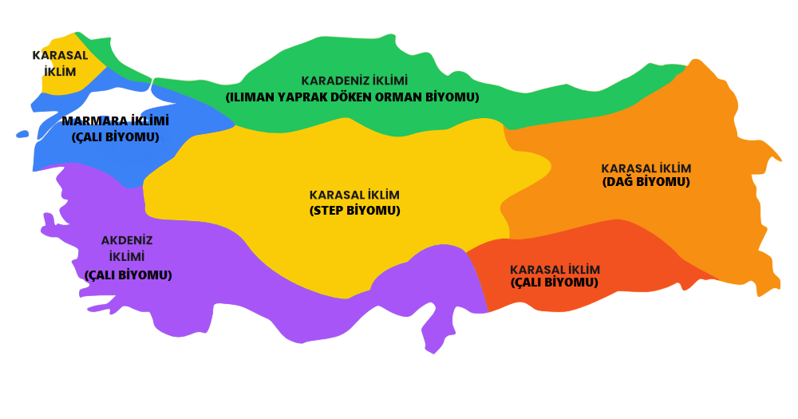

<!DOCTYPE html>
<html lang="tr">
<head>
  <meta charset="UTF-8">
  <meta name="viewport" content="width=device-width, initial-scale=1.0">
  <title>GeoVision 4006 - Türkiye İklim Ve Biyom Haritası</title>
  
</head>
<body>
  <header>
    <h1>GeoVision 4006 - Türkiye İklim Ve Biyom Haritası</h1>
    
Haritadan istediğiniz bölgeye tıklayarak orasının coğrafyasını keşfetmeye hazır olun!

  </header>

  <!-- Hafıza Oyunu Butonu -->
  

    <a href="https://fbkrl0.github.io/Haf-za-Oyunu/" target="_blank" class="game-button">
      Hafıza Arenası 
    </a>
  

  

    
  

  

  <!-- Biyom Grafiği -->
  

    <canvas id="biochart"></canvas>
  

  <map name="image-map">
    <!-- Akdeniz İklimi Bölgesi -->
    <area target="_blank" alt="Akdeniz İklimi" title="Akdeniz İklimi" href="https://fbkrl0.github.io/akdeniz-iklimi/" coords="175,384,59,237" shape="rect">
    <area target="_blank" alt="Akdeniz İklimi" title="Akdeniz İklimi" href="https://fbkrl0.github.io/akdeniz-iklimi/" coords="178,419,275,284" shape="rect">
    <area target="_blank" alt="Akdeniz İklimi" title="Akdeniz İklimi" href="https://fbkrl0.github.io/akdeniz-iklimi/" coords="251,293,303,386" shape="rect">
    <area target="_blank" alt="Akdeniz İklimi" title="Akdeniz İklimi" href="https://fbkrl0.github.io/akdeniz-iklimi/" coords="309,331,453,392,428,423,365,420,325,394,304,381,304,313,322,325,334,333,428,412,435,405,437,377,543,403,460,385" shape="poly">
    <area target="_blank" alt="Akdeniz İklimi" title="Akdeniz İklimi" href="https://fbkrl0.github.io/akdeniz-iklimi/" coords="456,389,469,357,521,392,519,337,488,341,476,349,504,336,515,330,533,316,565,322,573,350,600,384,609,389,591,337,592,389,546,429,544,440" shape="poly">
    <area target="_blank" alt="Akdeniz İklimi" title="Akdeniz İklimi" href="https://fbkrl0.github.io/akdeniz-iklimi/" coords="472,352,519,380,512,344" shape="poly">
    <area target="_blank" alt="Akdeniz İklimi" title="Akdeniz İklimi" href="https://fbkrl0.github.io/akdeniz-iklimi/" coords="550,312,581,318,585,358" shape="poly">
    
    <!-- Karasal İklim Bölgesi -->
    <area target="_blank" alt="Karasal İklim" title="Karasal İklim" href="https://fbkrl0.github.io/Karasal-iklim/" coords="185,244,434,153,660,224,422,350" shape="poly">
    <area target="_blank" alt="Karasal İklim" title="Karasal İklim" href="https://fbkrl0.github.io/Karasal-iklim/" coords="639,166,643,293,945,277,899,132,915,113,955,190,916,114" shape="poly">
    <area target="_blank" alt="Karasal İklim" title="Karasal İklim" href="https://fbkrl0.github.io/Karasal-iklim/" coords="965,359,869,331,629,290,955,280" shape="poly">
    <area target="_blank" alt="Karasal İklim" title="Karasal İklim" href="https://fbkrl0.github.io/Karasal-iklim/" coords="577,274,875,340,614,377,602,354,594,321" shape="poly">
    
    <!-- Karadeniz İklimi Bölgesi -->
    <area target="_blank" alt="Karadeniz İklimi" title="Karadeniz İklimi" href="https://fbkrl0.github.io/karadeniz-iklimi/" coords="200,104,312,157,651,144,583,101,535,70,494,43,361,44,313,92" shape="poly">
    <area target="_blank" alt="Karadeniz İklimi" title="Karadeniz İklimi" href="https://fbkrl0.github.io/karadeniz-iklimi/" coords="783,138,853,86,588,95,643,160" shape="poly">
    
    <!-- Marmara İklimi Bölgesi -->
    <area target="_blank" alt="Marmara İklimi" title="Marmara İklimi" href="https://fbkrl0.github.io/marmara-iklimi/" coords="18,172,51,118,93,123,133,87,223,117,140,190,42,215" shape="poly">
    <area target="_blank" alt="Marmara İklimi" title="Marmara İklimi" href="https://fbkrl0.github.io/marmara-iklimi/" coords="105,205,171,234,230,178,289,155,223,120,189,148" shape="poly">
  </map>

  <!-- Grafik için JavaScript -->
  
  
</body>
</html>
